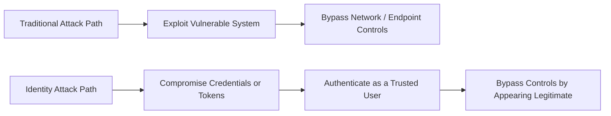
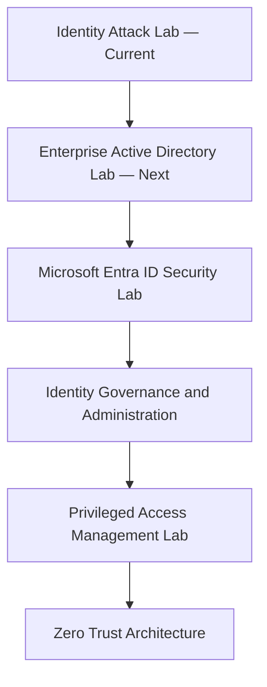
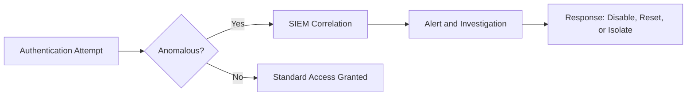

# Identity Attack Lab

### Understanding Identity-Based Attacks in Modern Enterprise Environments

A practical, enterprise-focused guide to identity-based attacks, detection strategies, and defense controls in modern IT environments.

---

## Navigation

[Introduction](#introduction) ·
[Learning Objectives](#learning-objectives) ·
[Skills Covered](#skills-covered) ·
[Repository Structure](#repository-structure) ·
[Learning Roadmap](#learning-roadmap) ·
[Labs](#labs) ·
[Documentation](#documentation) ·
[Interview Preparation](#interview-preparation) ·
[References](#references) ·
[Related Repositories](#related-repositories) ·
[Author](#author)

---

## Introduction

Modern cyberattacks are no longer focused solely on exploiting vulnerable systems — they increasingly target the identities that access those systems. Whether through stolen passwords, compromised authentication tokens, phishing, session hijacking, or the abuse of privileged accounts, attackers aim to *become* trusted users rather than break through technical defenses.

This shift has made identity one of the most critical control planes in enterprise security. Organizations invest heavily in firewalls, endpoint protection, and network security, but a single compromised identity can bypass many of those controls because the attacker appears to be a legitimate, authenticated user.

This repository explains how identity-based attacks work, why identity has become one of the most significant attack surfaces in cybersecurity today, and how enterprise security teams detect, investigate, and defend against these threats.

### Why Identity Matters

Consider an organization protected by enterprise firewalls, endpoint detection, layered network security, and modern antivirus solutions. An attacker doesn't need to exploit any of those controls — instead, they sign in using a legitimate employee's credentials.

From the organization's perspective, the login appears genuine. The attacker now has access to applications, files, cloud resources, and internal systems based on the permissions granted to that identity.

As organizations adopt cloud services, remote work, single sign-on (SSO), and SaaS applications, identity has become the gateway to nearly every business resource. Protecting it is no longer solely an IAM responsibility — it is a shared requirement across identity teams, SOC analysts, cloud engineers, and security architects.

### What is an Identity Attack?

An **identity attack** is a cyberattack in which an adversary targets digital identities — user accounts, passwords, authentication tokens, sessions, or privileged credentials — in order to impersonate legitimate users and gain unauthorized access to enterprise resources.

Unlike traditional attacks that primarily exploit software vulnerabilities or network weaknesses, identity attacks abuse **trust**. Once an attacker assumes a trusted identity, they can often move through systems, applications, and data while appearing to be a legitimate user.

A successful identity attack may lead to privilege escalation, lateral movement, persistence, data exfiltration, ransomware deployment, or full environment compromise.

### Common Identity Attack Techniques

| Technique | Summary | Requires |
|---|---|---|
| Phishing | Tricking a user into revealing credentials or approving access | Social engineering vector (email, SMS, voice) |
| Credential Theft | Extracting stored or cached credentials from a system | Local system or endpoint access |
| Password Spraying | Trying one common password across many accounts to avoid lockouts | List of valid usernames |
| Brute Force | Systematically guessing a password for a single account | No lockout policy, or unlimited attempts |
| Credential Stuffing | Reusing breached credentials across multiple services | Previously breached credential dataset |
| Pass-the-Hash | Authenticating using a stolen password hash instead of the plaintext password | Local admin / cached hash on a compromised host |
| Pass-the-Ticket | Reusing a stolen Kerberos ticket to authenticate | Extracted Kerberos ticket from memory |
| Kerberoasting | Extracting and offline-cracking a service account's password via its Kerberos service ticket | Any valid domain user account |
| Golden Ticket | Forging a Kerberos Ticket-Granting Ticket (TGT) to impersonate any user, indefinitely | Compromised **KRBTGT account hash** |
| Silver Ticket | Forging a Kerberos service ticket for one specific service | Compromised **target service account's hash** |
| Session Hijacking | Stealing or reusing an active authentication session | Access to a session token or cookie |
| MFA Fatigue | Repeatedly triggering MFA push prompts until a user approves one out of frustration | Valid username and password |
| OAuth Token Theft | Stealing or abusing OAuth tokens to access resources without a password | Malicious app consent or token interception |
| Privileged Account Abuse | Misusing legitimate administrative access | Existing privileged access |
| Insider Threats | Malicious or negligent misuse of access by an authorized user | Existing authorized access |

Each of these techniques targets the trust placed in a digital identity rather than a technical vulnerability in a system. Golden Ticket and Silver Ticket are frequently confused: the key distinction is *scope and source* — a Golden Ticket relies on the domain-wide KRBTGT hash and grants access to virtually anything, while a Silver Ticket relies on a single service account's hash and is limited to that one service.

### Enterprise Perspective

Modern enterprises no longer treat identity as purely an IT function — it is a core pillar of cybersecurity.

Identity attacks frequently target Active Directory, Microsoft Entra ID, VPNs, cloud applications, privileged accounts, and SaaS platforms, because these systems govern access to critical business resources.

Enterprise security teams rely on Identity & Access Management (IAM), Privileged Access Management (PAM), Multi-Factor Authentication (MFA), Identity Governance (IGA), Zero Trust principles, and continuous monitoring to reduce the risk of identity compromise. Protecting identities today is a shared responsibility between IAM engineers, SOC analysts, cloud security engineers, and security architects.

---

## Learning Objectives

By the end of this repository, you will be able to:

- Explain what an identity attack is and why it represents a major cybersecurity threat.
- Understand why identities have become a primary target in modern enterprise environments.
- Recognize common identity attack techniques used by adversaries.
- Understand the stages of a typical identity attack lifecycle.
- Identify enterprise detection and defense strategies against identity-based attacks.
- Build a foundation for advanced topics such as Active Directory, Microsoft Entra ID, Identity Governance, and Zero Trust.
- Confidently answer common interview questions related to identity attacks.

---

## Skills Covered

| Domain | Skills |
|---|---|
| Identity Security Fundamentals | Authentication vs. authorization, identity as a control plane, trust-based compromise |
| Attack Techniques | Phishing, credential theft, password spraying, brute force, credential stuffing, Pass-the-Hash, Pass-the-Ticket, Kerberoasting, Golden/Silver Ticket, session hijacking, MFA fatigue, OAuth token theft |
| Detection | Authentication log analysis, impossible travel detection, UEBA concepts, SIEM correlation |
| Defense & Governance | MFA, Conditional Access, RBAC, JML, SoD, PAM, JIT/JEA access |
| Enterprise Tooling Awareness | Microsoft Sentinel, Splunk, QRadar, Exabeam, Sumo Logic, Microsoft Defender for Identity |
| Professional Readiness | Structured incident scenarios, interview-style Q&A across skill levels |

---

## Repository Structure

Single-file repository — all content, documentation, and the lab live in this README.

---

## Learning Roadmap

This repository is the entry point of the Haris Trust Enterprise Identity Security Portfolio. It establishes the concepts and terminology used throughout every subsequent repository.

Full descriptions and status for each stage are listed in [Related Repositories](#related-repositories).

---

## Labs

### Lab 1 — Password Spraying Investigation

**Scenario**

You are an IAM Engineer supporting a global enterprise. The SOC team reports the following:

- 143 user accounts each received one failed login attempt.
- Every attempt used the same password.
- Attempts originated from a foreign IP address.
- No accounts were locked.

**Questions**

1. What attack is occurring?
2. Why weren't accounts locked?
3. Which security logs would you investigate?
4. What should the SOC team do?
5. What long-term controls should be implemented?

**Answers**

1. **Attack:** This is a **password spraying attack** — the attacker tries one commonly used password across many accounts, rather than many passwords against one account.

2. **Why no lockouts occurred:** Standard account-lockout policies trigger only after several *consecutive failed attempts on the same account* (e.g., 5 attempts in 30 minutes). Because each of the 143 accounts received only **one** failed attempt, no account crossed its individual lockout threshold — this is precisely why attackers use password spraying instead of brute force: it is designed to stay under per-account lockout thresholds while still testing many accounts.

3. **Logs to investigate:** Azure AD / Active Directory sign-in logs (filtered by source IP and time window), authentication logs from the affected identity provider, Conditional Access / Sentinel sign-in risk logs, and VPN or SSO gateway logs if applicable.

4. **Immediate SOC response:** Identify any accounts among the 143 with a subsequent *successful* login using the sprayed password; force immediate password resets on those; block or throttle the source IP/range; and raise an incident if any affected account holds privileged access.

5. **Long-term controls:** Enforce MFA on all accounts (removes the value of a correctly guessed password); enable smart lockout / risk-based Conditional Access policies keyed on IP reputation and impossible travel rather than per-account attempt count alone; enforce a banned-password list to eliminate common passwords as a viable spray target; and monitor for spray patterns (many accounts, one password, short time window) directly in the SIEM.

---

## Documentation

### Detection & Defense

Identity attacks rarely begin with malware. Most begin with a seemingly legitimate authentication attempt. Detecting them requires monitoring authentication behavior, user activity, privileged access, and identity-related events — not just endpoint or network telemetry.

#### Detection Indicators

- Multiple failed logins from different locations
- **Impossible travel** — sign-ins from two geographically distant locations within a timeframe that would be physically impossible to travel between (e.g., New York, then Singapore, 20 minutes later)
- Password spraying attempts
- Brute-force authentication attempts
- Privileged account logins outside business hours
- Multiple MFA prompts in a short window (MFA fatigue)
- Unusual VPN access
- Creation of new privileged accounts
- Unexpected group membership changes
- Service account abuse
- Authentication from TOR or anonymous IP addresses
- Suspicious OAuth consent grants
- Dormant account usage
- Lateral movement between systems

Enterprise SIEM platforms correlate these events to surface suspicious identity behavior. **Microsoft Sentinel**, for example, ingests Azure AD / Entra ID sign-in and audit logs, applies built-in analytics rules (such as impossible travel, atypical travel, and password-spray detections), and correlates them with signals from Microsoft Defender for Identity to produce a single prioritized incident rather than dozens of disconnected alerts. Splunk, QRadar, Exabeam, and Sumo Logic serve the equivalent correlation role in non-Microsoft-centric environments.

#### Defense Strategies

**Identity Protection**
- Multi-Factor Authentication (MFA) — including number-matching / push-approval controls that directly mitigate MFA fatigue attacks
- Passwordless Authentication
- Strong Password Policies
- Conditional Access Policies
- Risk-Based Authentication

**Identity Governance**
- Joiner-Mover-Leaver (JML)
- Least Privilege Access
- Role-Based Access Control (RBAC)
- Periodic Access Reviews
- Segregation of Duties (SoD)

**Privileged Access Protection**
- Privileged Access Management (PAM)
- Just-In-Time (JIT) Access
- Just-Enough Administration (JEA)
- Session Recording
- Credential Vaulting

**Monitoring & Detection**
- Identity Threat Detection
- User and Entity Behavior Analytics (UEBA)
- Continuous Authentication
- Continuous Monitoring
- Security Information and Event Management (SIEM)

A mature identity security program combines prevention, detection, and rapid response — no single control is sufficient on its own.

### From the Field

One of the most common misconceptions in cybersecurity is that attackers always exploit software vulnerabilities. In reality, many successful attacks begin with compromised identities. Once an attacker obtains valid credentials, they often bypass traditional security controls entirely because they appear to be a legitimate user.

Identity security is no longer just an IAM responsibility — it is a shared responsibility across security operations, cloud security, infrastructure, governance, and IT operations.

### Key Takeaways

- Identity is one of the most valuable assets in modern cybersecurity.
- Most modern attacks target trusted identities rather than systems.
- Identity attacks abuse trust instead of exploiting technical vulnerabilities.
- Strong identity hygiene significantly reduces organizational risk.
- IAM, PAM, MFA, Zero Trust, and continuous monitoring form the foundation of enterprise identity security.
- Understanding identity attacks is essential for every cybersecurity professional.

---

## Interview Preparation

### Beginner

- What is an identity attack? *(see [What is an Identity Attack?](#what-is-an-identity-attack))*
- Why are identity attacks increasing? *(see [Why Identity Matters](#why-identity-matters))*
- What is the difference between authentication and authorization?
- What is MFA?
- What is RBAC? *(see [Defense Strategies](#defense-strategies))*

### Intermediate

- Explain password spraying. *(see [Lab 1](#lab-1--password-spraying-investigation))*
- Explain credential stuffing.
- What is Pass-the-Hash?
- What is Kerberoasting?
- What is the difference between a Golden Ticket and a Silver Ticket? *(see [Common Identity Attack Techniques](#common-identity-attack-techniques))*
- What is lateral movement?
- What is privilege escalation?

### Enterprise

- How would you detect identity attacks in Microsoft Sentinel? *(see [Detection & Defense](#detection--defense))*
- Which logs would you monitor for identity-based threats?
- How does Zero Trust reduce the risk of identity attacks?
- How would you secure privileged identities in a large organization? *(see [Privileged Access Protection](#defense-strategies))*
- Explain identity governance in an enterprise environment.

---

## References

- Microsoft Learn
- Microsoft Defender for Identity Documentation
- Microsoft Entra Documentation
- MITRE ATT&CK Framework
- OWASP Identity & Access Control Guidance
- CISA Identity and Access Management Resources
- NIST Cybersecurity Framework (CSF)
- NIST SP 800-63 Digital Identity Guidelines

---

## Related Repositories

| Repository | Description | Status |
|---|---|---|
| Identity Attack Lab | Identity attack fundamentals and enterprise defense (this repository) | Current |
| Enterprise Active Directory Lab | Domains, forests, domain controllers, GPO, Kerberos/NTLM, AD attacks | Next |
| Microsoft Entra ID Security Lab | Cloud identity, Conditional Access, hybrid identity security | Planned |
| Identity Governance and Administration | JML, access reviews, SoD, entitlement management | Planned |
| Privileged Access Management Lab | PAM architecture, JIT/JEA, credential vaulting | Planned |
| Zero Trust Architecture | Zero Trust principles applied across identity, device, and network | Planned |

---

## Author

**Haris Trust**
*Guarding Digital Trust.*

Enterprise Identity Security Portfolio

